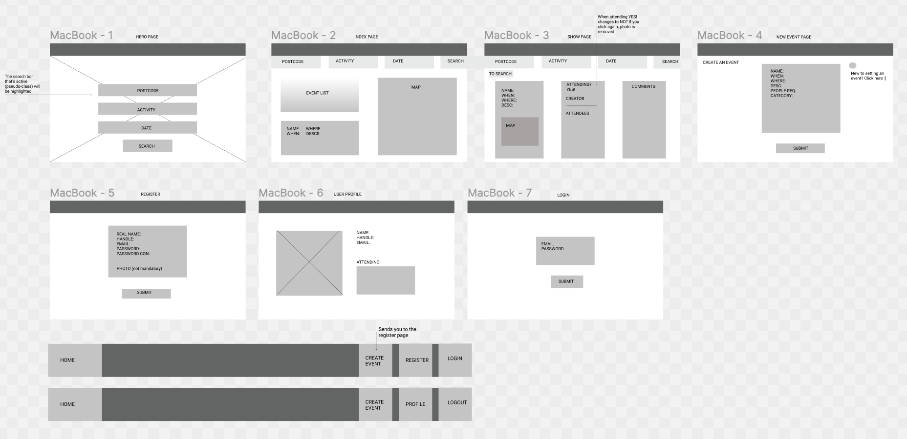
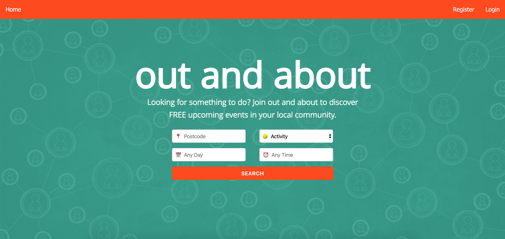
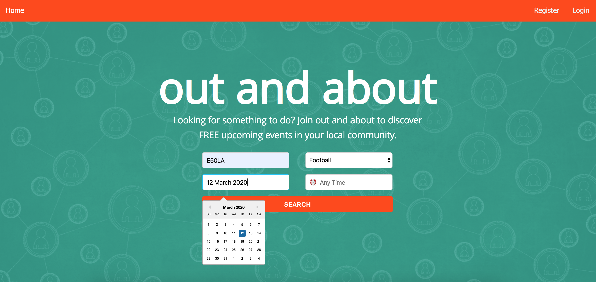
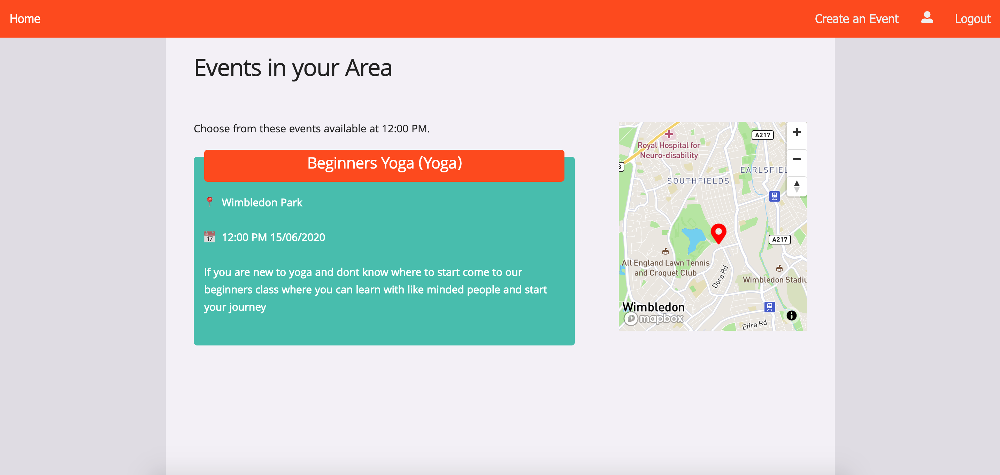
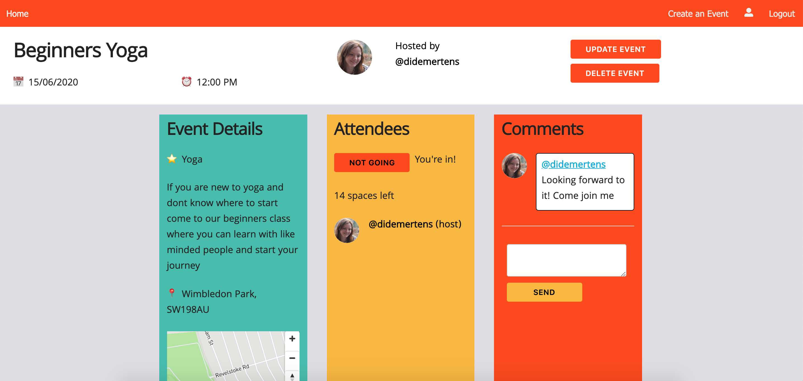
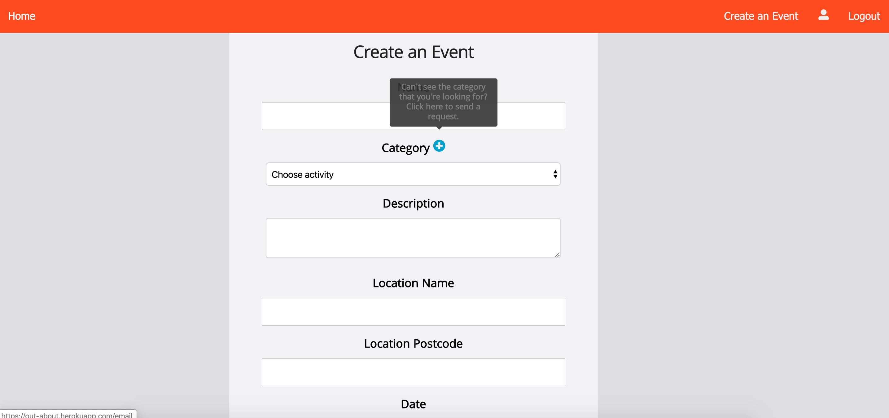
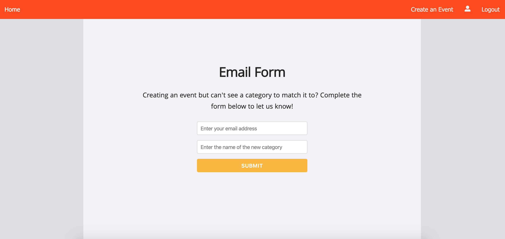
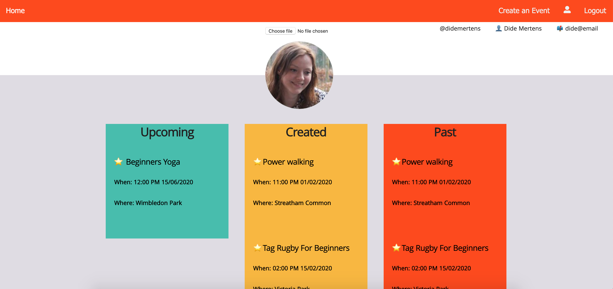

#  Project 3: Out and About

Out and About was a group project lasting 8 days during which we built a website for free outdoor events. Users can search on their postcode, activity type, date and time to see if there are any free events in their area. They can also create events themselves and attend events.

## Teammates
* Christine: https://github.com/ckapak
* George: https://github.com/georgeanthony33
* Jesse: https://github.com/Jesse2889

## Built with
* React
* Express
* Node.js
* MongoDB
* Skeleton
* Sass
* Axios
* Bulma
* Git
* GitHub

## Deployment
The website is deployed on Heroku and can be found [here](https://out-about.herokuapp.com/).

## Getting started
Use the clone button to download the source code. Run the following commands in the terminal:
```
<!-- To install all the packages listed in the package.json: -->
$ yarn

<!-- Run the app in your localhost: -->
$ yarn start:front
$ yarn start:back
```

## Website architecture


The main components of the website are the home page, index page which links to the detail page of each event, the profile page and the create event page. I built a wireframe in Figma so we had a visual guide. We also used Trello so we could create and assign tickets. 

### 1. Home page

 

The home page consists of the name of the website and a search bar. Users can search on their postcode, type of activity, date and time. I was responsible for this search functionality. I used 'react-datepicker' to show the calendar and the times. I converted these to an ISOString and LocaleTimeString before sending it to our database, so every date and time had the same format.


### 2. Index page



After searching for an activity on the home page, the user is send to the index page. This page shows the event(s) available. I built the filter and sort functionality of this page. The first thing I did, was filter out all of the old events as we didn't want to show those on this page. After that I checked whether there were any events of the activity type searched for, for example 'field hockey' or 'yoga'. After that I filtered on the postcode, date and time. If we didn't have an event that completely matched the search, we would show the next best activity (such as for a different date or time). For example, this function checks if there are any events at the searched for time:

``` javascript
 if (eventsByTime.length === 0) {
      this.setState({
        noEventsMessage: `Here are all the events available on ${date}.`
      })
      const sortedEvents = this.sortDateTime(eventsByDates)
      events = [...sortedEvents]
    } else {
      const sortedEventsTime = this.sortDateTime(eventsByTime)
      events = [...sortedEventsTime]
      this.setState({
        noEventsMessage: `Choose from these events available at ${searchData.time}.`
      })
    }
```

Because MongoDB uses a specific format for dates, I also had to convert those to be able to filter the search results on date and time. See the sort function below. I used the Moment.js package to check the time, as I could extract the times more easily from the dates and change these into valid floats. For the dates I could just use the JavaScript Date object. 

``` javascript
sortDateTime = (array) => {
    const sortedArray = [...array].sort((a, b) => {
      if (a.date === b.date) {
        const aTime = moment(a.time, ['h:mm A']).format('HH:mm').replace(':', '.')
        const bTime = moment(b.time, ['h:mm A']).format('HH:mm').replace(':', '.')
        return (aTime - bTime)
      } else {
        return new Date(a.date) - new Date(b.date)
      }
    })
    return sortedArray
  }
```

I also worked on implementing the map feature together with a teammate. We used the third-party API Mapbox, adding a marker and pop-up to the map. That way it's clear where each of the events is taking place.  

### 3. Detail page
 

The detail page shows all of the information of a particular event. Users can attend/unattend events here and they can also leave comments. The host of the event is automatically attending and can also update and delete the event. 

### 4. Create (and update) event page

 

To create (or update) an event, users have to pick the category of their event. Because we knew that there would be categories missing, I added a feature to this form. If someone clicks on the + button, they are send to a page where they can leave their email and can fill in the category they want to add.



After submitting, an email is send to the email address of our group, so one of us can add it to the website. I built this email functionality using the third-party API SendGrid. The form input is send to the back-end, where the following function is called, sending an email to our email address:

``` javascript
function sendEmail(req, res) {
  const msg = {
    to: 'teamoutabout@gmail.com',
    from: req.body.from,
    subject: 'New Category Request',
    text: req.body.text
  }
  sgMail.send(msg)
  return res.status(200).json({ message: 'Done' })
}
```

I grabbed the opportunity to also write tests for the events. I was in charge for the tests related to showing, creating, deleting and updating an event. I really enjoyed writing these tests as I could work on my Mocha and Chai skills.

### 5. Profile page


On the profile page, users can change their picture and see the events they created and are attending. I wrote the filter functionality to show the appropriate events in each column, for example an event in the future should be 'upcoming' and events that are in the past have to be shown as such. These events also had to be sorted based on the date and time, for which I used the same sorting function as for the index page. One other feature I worked together on with someone else from my team was having a default image if a user hadn't uploaded an image during registration. Now their picture won't be blank, but a photo of a tennis ball will be shown. 

## Wins and challenges 
* The biggest win of this project was working in a group. It was amazing to be able to tackle all of the tasks and bugs together. We helped each other a lot and also always decided together when we needed to make an important choice. For example about the design of the overall website and how we wanted the search functionality to work.
* It was also great to use a Trello board with all the tickets that had to be done, someone was working on and those that were already done. That way, we always had something to do and we knew who had worked on what part of the project. 
* One of the challenges of this project was using the CSS framework Skeleton. We wanted to use a different framework, one we weren't familiar with yet, but that also meant that it took a while before we were comfortable with the framework. As a consequence, we didn't have any time left to make the website more responsive. 

## Future improvements
* I would like to add a weather API to not only show the date, time and place of the event, but also what the weather is going to be like. 
* Another feature I would like to add is a wait list. If an event is full, users would be able to add themselves to a wait list and automatically be added to the attendees of the event when a place would become available.
* We made tests for the back-end. However, there aren't any tests for the React components so I would like to create these as well using Enzyme and Jest.


